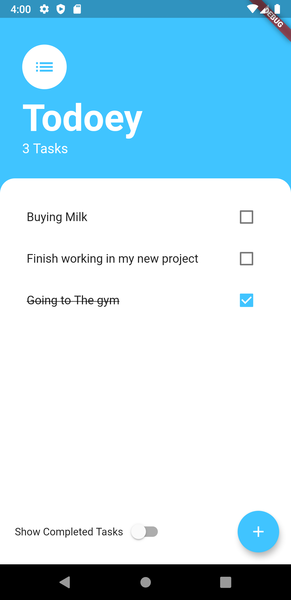
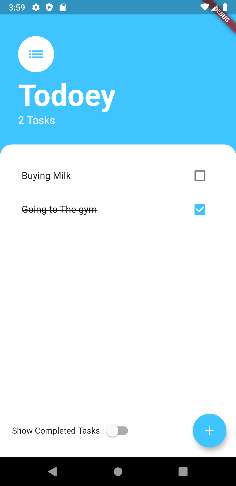
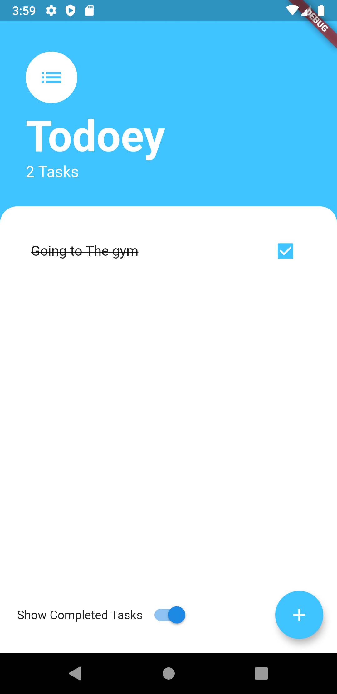

# Todoey ✓

this amazing app was created by the [App Brewery](https://www.appbrewery.co/) team as part of a Udemy course I have enrolled in and I wanted to get the chance to make it better by adding a new local `SQlite` database to save the tasks.

## Implementation

  